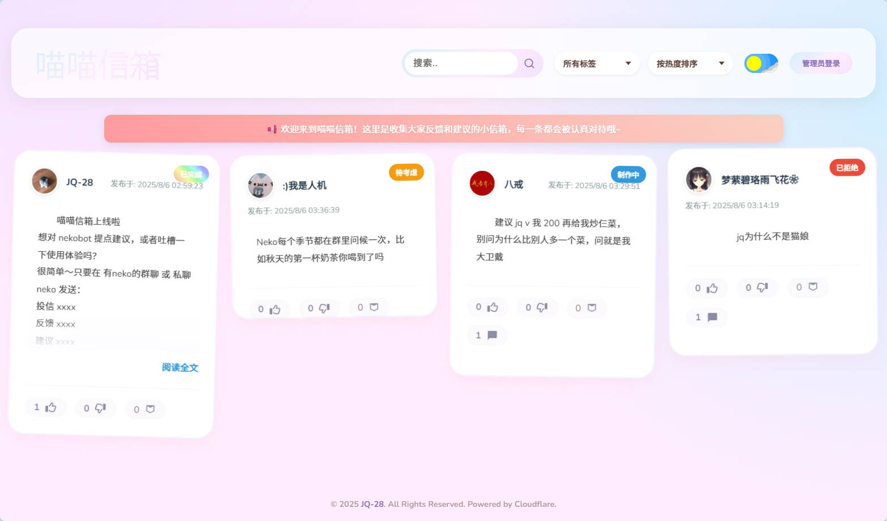
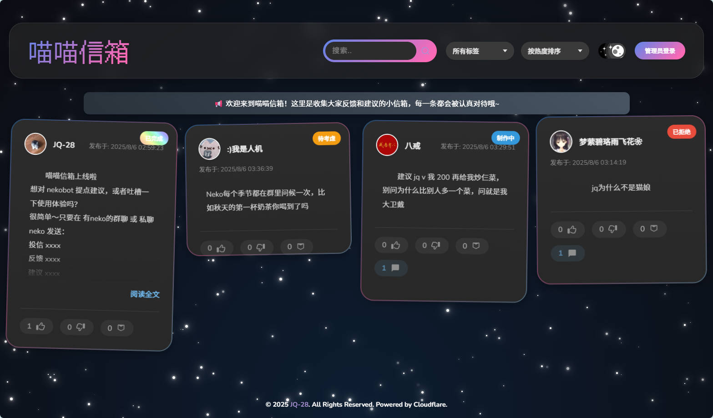

# NekoInbox - 用户反馈与建议插件

[](./LICENSE)
[](https://www.cloudflare.com/)
[](https://github.com/JQ-28/NekoInbox)

这是一个全栈项目，旨在通过 NoneBot2 机器人收集用户的反馈与建议，并将其展示在一个美观、交互性强的网页上。网页由 Cloudflare Pages 和 Workers 驱动，实现了数据的展示、排序、管理等功能。

## 🌐 在线体验

您可以访问以下地址在线体验NekoInbox：

**[https://input.nekodayo.top](https://input.nekodayo.top)**

## ✨ 项目特色

- **前后端分离**: NoneBot2 插件作为数据入口，Cloudflare Worker 作为后端 API，网页作为前端展示，架构清晰。
- **功能完善**: 支持建议/反馈提交、**点赞/点踩**、**举报**、管理员**回复/删除/设置标签**等。
- **丰富的前端交互**: 实现了基于 **CSS Grid** 的瀑布流布局、无限滚动、图片懒加载、实时搜索、排序和标签过滤、**自定义下拉菜单**、**Toast 通知**、**长文阅读弹窗**和**回到顶部**功能。
- **精美的 UI**: 拥有一个支持**亮色/暗色模式**切换的、带有流畅动画的现代化界面，暗色模式下还有**动态星空背景**。初始加载时使用**骨架屏**优化用户感知速度。
- **性能优化**: 对滚动等高频事件进行**节流(Throttle)**处理，减少不必要的计算，保证页面流畅运行。
- **安全可靠**: 使用 JWT (JSON Web Tokens) 进行管理员权限验证，并集成了 **Cloudflare Turnstile** 人机验证，保护公开接口，有效防止滥用。
- **邮件提醒**: 当有用户举报消息时，可配置通过 [Resend](https://resend.com/) 服务向管理员发送邮件提醒。

## 🖼️ 效果预览




## 🚀 技术栈

- **机器人端**: NoneBot2, httpx
- **后端**: Cloudflare Workers, Cloudflare KV, Cloudflare Turnstile, Resend
- **前端**: 原生 HTML5 / CSS3 / JavaScript (ES6+), CSS Grid Layout

---

## 🛠️ 部署指南

本指南将带你从零开始，一步步部署完整的 NekoInbox 系统。

### 1. 准备工作

在开始之前，请确保你拥有：
- 一个 [Cloudflare](https://www.cloudflare.com/) 账户（需要绑定域名）
- 一个 [GitHub](https://github.com/) 账户。
- [Node.js](https://nodejs.org/en/) (v16.13.0 或更高版本) 和 [npm](https://www.npmjs.com/)。
- [Python](https://www.python.org/) (3.8 或更高版本) 和 [pip](https://pip.pypa.io/en/stable/)。

### 2. Fork & 克隆项目

首先，Fork 本项目到你的 GitHub 账户，然后将它克隆到你的本地电脑：
```bash
git clone https://github.com/JQ-28/NekoInbox.git
cd NekoInbox
```

### 3. 部署后端 (Cloudflare Worker)

后端服务是整个系统的核心，负责处理数据和逻辑。

#### 步骤 1: 创建 Worker 并连接到 Git 仓库

1.  访问 Cloudflare 仪表盘 -> `Workers & Pages` -> `Workers` -> `Import a repository`。
2.  选择你 Fork 的 `NekoInbox` 仓库。
3.  在 **Set up your application** 中：
    - **Project name**: 为你的 Worker 服务起一个名字 (例如 `nekoinbox-api`)。
4.  点击 `Create and Deploy`。Cloudflare 会自动为你创建 Worker 并完成首次部署。

#### 步骤 2: 创建并绑定 KV 数据库

我们需要一个 KV 命名空间来存储所有的反馈数据。

1.  在 Cloudflare 仪表盘，进入 `Storage & Databases`，选择KV。
2.  点击**Create Instance**，起**Namespace name**为`FEEDBACK_KV`
3.  在 Cloudflare 仪表盘，进入 `Workers & Pages`，选择刚刚创建的 Worker。
4.  找到 **KV Namespace**，点击 `Add binding`
5.  **Variable name**填`FEEDBACK_KV`，**KV namespace**选择刚刚创建的KV库，随后点击`Add Bingding`

#### 步骤 3: 创建 Turnstile 小组件

为了防止机器人滥用，我们需要配置人机验证。

1.  访问 Cloudflare 仪表盘 -> `Turnstile`。
2.  创建一个新的小组件，小组件模式选择“托管”。
3.  在 **主机名** 字段，**必须**填入你将要为前端页面绑定的自定义域名（例如 `feedback.yourdomain.com`）。
4.  创建后，获取 **Site Key** 和 **Secret Key**。

#### 步骤 4: 设置密钥

**这是最重要的一步。** 为了安全，所有敏感信息都必须在 Worker 的设置中配置为密钥。

1.  回到你的 Worker 设置页面 (`Settings` -> `Variables and Secrets`)。
2.  点击`Add`来添加加密密钥，**TYPE**都为`Secret`
3.  根据下表，依次添加所有必需的密钥：

| 变量名                  | 值                                                               | 描述                                       |
| ----------------------- | ---------------------------------------------------------------- | ------------------------------------------ |
| `TURNSTILE_SECRET_KEY`  | (从上一步获取)                                                   | Turnstile 的 Secret Key。                  |
| `TURNSTILE_SITE_KEY`    | (从上一步获取)                                                   | Turnstile 的 Site Key，会公开给前端。      |
| `ADMIN_PASSWORD`        | (自定义)                                                         | 用于登录网页后台的密码。                   |
| `JWT_SECRET`            | (自定义，一个长而随机的字符串)                                   | 用于签发管理员登录凭证的密钥。             |
| `API_TOKEN`             | (自定义，一个长而随机的字符串)                                   | 用于 NoneBot 插件与后端通信的“暗号”。 （需要记下用于之后nonebot配置）     |
| `FRONTEND_URL`          | (你的前端页面**自定义域名** URL)                                 | 你的前端最终访问地址，**必须**是为 Pages 绑定的自定义域名。用于配置 CORS 策略。 |
| `RESEND_API_KEY`        | (可选)                                                           | Resend 服务的 API Key。                    |
| `SENDER_EMAIL`          | (可选, 例如 `noreply@yourdomain.com`)                            | 发送提醒邮件的邮箱地址。                   |
| `RECIPIENT_EMAIL`       | (可选, 你的接收邮箱)                                             | 接收举报通知的管理员邮箱。                 |

4.  每添加一个密钥后，记得点击 `Save`。

部署成功后，你的后端服务就正式上线了！后续对 `api/worker.js` 的任何修改，只需要推送到 GitHub，Cloudflare 就会自动帮你完成部署。

### 4. 部署前端 (Cloudflare Pages)

前端页面用于展示和管理所有反馈。

1.  访问 Cloudflare 仪表盘 -> `Workers & Pages` -> `Create` -> `Pages` -> `Import an existing Git repository`。
2.  选择你 Fork 的 `NekoInbox` 仓库。
3.  在 **Build settings** 中：
    - **Framework preset**: 选择 `None`。
    - **Build command**: (留空)
    - **Build output directory**: 填入 `web`。
    4.  展开 **Environment variables (advanced)** 部分，点击 `Add variable` 添加一个环境变量：
        - **Variable name**: `API_BASE_URL`
        - **Variable value**: 填入你**第 3 步**部署的 Worker 的 URL (例如: `https://your-worker-name.your-username.workers.dev`)
    5.  点击 `Save and Deploy`。
    6.  部署完成后，Cloudflare 会为你提供一个 `*.pages.dev` 的默认地址。但为了让 Turnstile 人机验证正常工作，**您必须为其绑定一个自定义域名**。
    7.  进入刚刚创建的 Pages 项目，选择 `Custom domains` -> `Set up a domain`，然后按照指引，将您的域名（或子域名，如 `feedback.yourdomain.com`）绑定到此项目。
    8.  绑定成功后，请将这个**自定义域名 URL** (例如 `https://feedback.yourdomain.com`) 填入你**第 3 步**部署 Worker 时设置的 `FRONTEND_URL` 密钥中，以确保 CORS 策略正常工作。
    
    > **它是如何工作的？**
    > 项目根目录下的 `functions` 文件夹是一个 [Cloudflare Pages Function](https://developers.cloudflare.com/pages/functions/)。Cloudflare 会自动识别并部署它。这个函数会在您的静态页面发送给用户之前，拦截请求，并将您在上面设置的 `API_BASE_URL` 环境变量动态地注入到 HTML 中。这样，前端代码就能自动获取到后端的正确地址，实现了零手动配置的部署。
    
    ### 5. 配置机器人插件 (NoneBot2)

最后，让你的 NoneBot 机器人能够将收集到的消息发送到后端。

1.  将 `nonebot_plugin_nekoinbox` 文件夹放入你的机器人 `plugins` 目录。
2.  在你的机器人项目的 `.env` 或 `.env.prod*` 配置文件中，添加以下三行：

```dotenv
# 你的 Worker URL (从后端部署第 6 步获取)
CF_WORKER_URL="https://nekoinbox-worker.your-username.workers.dev"

# 你的 API 访问令牌 (与后端部署第 5 步中设置的 API_TOKEN 保持一致)
CF_API_TOKEN="your_super_secret_api_token"

# 你的前端页面 URL (从前端部署第 5 步获取)
NEKOINBOX_FRONTEND_URL="https://your-project.pages.dev"
```

3.  重启你的 NoneBot 实例。

至此，整个 NekoInbox 系统已经部署完成！现在你可以通过向机器人发送 `投信 [内容]` 来测试了。

## 📁 项目结构说明

```
.
├── .gitignore                # Git 忽略文件配置
├── CONTRIBUTING.md           # 贡献指南
├── LICENSE                   # MIT 许可证
├── README.md                 # 项目主说明文档
├── worker.js                 # Cloudflare Worker 的核心后端逻辑
├── wrangler.toml             # Worker 配置文件 (服务名称, KV绑定等)
├── functions/
│   └── [[path]].js           # Cloudflare Pages Function, 用于动态注入环境变量
├── assets/                   # README 中使用的图片资源
│   ├── 浅色.jpg
│   └── 深色.jpg
├── nonebot_plugin_nekoinbox/
│   └── __init__.py           # NoneBot2 插件入口及逻辑
└── web/
    ├── index.html            # 前端主页面
    ├── neko.webp             # 网站图标
    ├── css/
    │   └── style.css         # 页面所有样式
    └── js/
        ├── api.js            # 封装与后端 API 的所有通信
        ├── constants.js      # 存放项目中的常量 (如本地存储键名)
        ├── events.js         # 统一管理页面所有的事件监听器
        ├── main.js           # 页面主逻辑入口，负责初始化和加载
        └── ui.js             # 负责所有 UI 相关的操作 (如渲染消息, 显示/隐藏加载动画)
```

## 📞 联系我

- QQ: 480352716
- 如果您有任何问题或建议，欢迎提交 [Issue](https://github.com/JQ-28/NekoInbox/issues)。

## 🤝 贡献

欢迎为这个项目做出贡献！如果您有任何想法、建议或发现了 Bug，请随时提交 [Issues](https://github.com/JQ-28/NekoInbox/issues)。

如果您想贡献代码，我们推荐您先阅读详细的 [**贡献指南 (CONTRIBUTING.md)**](./CONTRIBUTING.md)，它将帮助您更顺利地参与到项目中。

基本流程如下：
1.  Fork 本仓库
2.  创建您的特性分支 (`git checkout -b feature/AmazingFeature`)
3.  提交您的更改 (`git commit -m 'Add some AmazingFeature'`)
4.  将代码推送到您的分支 (`git push origin feature/AmazingFeature`)
5.  提交一个 Pull Request

## 📄 许可证
本项目采用 MIT 许可证。

### 使用限制

作者衷心希望本项目能够帮助到更多的人，并鼓励大家在此基础上进行学习和二次创作。但请注意，作者不希望本项目的任何部分被直接用于商业销售行为。希望得到大家的尊重和理解。

## 📝 TODO List

未来计划增加以下功能，欢迎有兴趣的开发者一起贡献！

- **R2 存储集成**:
  - [ ] **机器人端**: 支持用户在发送反馈时附带图片，插件将图片上传到 Cloudflare R2 并记录 URL。
  - [ ] **网站端**: 支持登录用户在发表反馈时直接上传图片到 R2。
  - [ ] **后端**: 开发与 R2 交互的接口（上传、删除），并在消息体中存储图片地址。
  - [ ] **前端**: 在消息卡片中展示用户上传的图片。
- **网站端用户系统**:
  - [ ] **用户认证**: 引入 OAuth (如 GitHub, QQ) 或邮箱验证码登录机制。
  - [ ] **用户提交**: 允许登录用户直接在网页上发布新的反馈/建议（包括文字和图片）。
  - [ ] **用户中心**: 创建用户个人页面，用于查看和管理自己提交的所有历史记录。
- **功能优化与增强**:
  - [ ] **管理员仪表盘**: 增加一个数据统计面板，用于可视化展示反馈数量、趋势、热门词云等。
  - [ ] **消息通知**: 当用户的反馈被回复或状态变更时，通过机器人私聊或邮件向用户发送通知。
